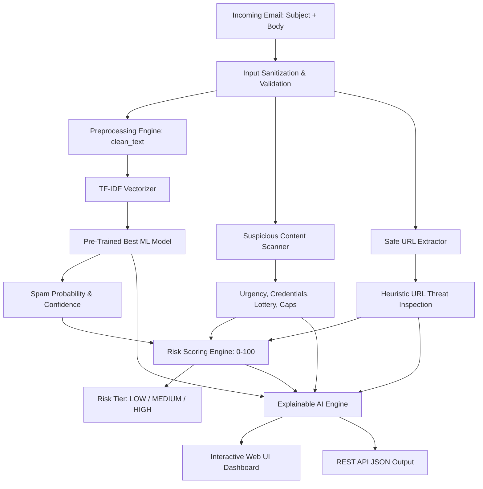

# Smart Spam Email Detection System 🛡️🤖

[](https://www.python.org/downloads/)
[](https://flask.palletsprojects.com/)
[](https://scikit-learn.org/)
[](https://opensource.org/licenses/MIT)
[](https://render.com)

A **production-grade, deployment-ready AI/ML web application** designed for intelligent email security analysis. The system analyzes email subjects and bodies to detect spam, phishing scams, and malicious lures using machine learning classification, heuristic threat scanning, safe URL forensics, composite 0–100 risk scoring, and Explainable AI (XAI).

---

## Table of Contents

1. [Project Overview](#project-overview)
2. [5 Main Features](#5-main-features)
3. [Technology Stack](#technology-stack)
4. [Project Architecture](#project-architecture)
5. [Project Directory Structure](#project-directory-structure)
6. [Quick Start & Local Installation](#quick-start--local-installation)
7. [Model Training & Benchmarking](#model-training--benchmarking)
8. [Running Locally](#running-locally)
9. [REST API Documentation](#rest-api-documentation)
10. [Step-by-Step Render Deployment Guide](#step-by-step-render-deployment-guide)
11. [Railway & Docker Deployment](#railway--docker-deployment)
12. [Updating & Redeploying](#updating--redeploying)
13. [Security Considerations](#security-considerations)
14. [Final-Year Viva & Presentation Guide](#final-year-viva--presentation-guide)

---

## 1. Project Overview

Email remains the primary initial access vector for cyber attacks, phishing campaigns, and malware delivery. Traditional keyword filters often fail against modern obfuscated phrasing or produce excessive false positives.

The **Smart Spam Email Detection System** bridges this gap through a multi-stage security pipeline:
* **Binary Classification**: Determines whether an incoming message is **SPAM** or **NOT SPAM (HAM)**.
* **Calibrated Confidence**: Delivers probability distributions ($P(\text{Spam})$ and $P(\text{Ham})$).
* **Multi-Factor Threat Analysis**: Extracts deep heuristic indicators (urgency, credential harvesting, fake lottery windfalls).
* **Safe URL Inspection**: Analyzes hyperlink characteristics without sending network requests to untrusted targets.
* **Unified Risk Score (0–100)**: Combines ML probability and rule-based heuristics into an actionable risk tier.
* **Explainable AI (XAI)**: Identifies the mathematical and semantic drivers behind every classification.

---

## 2. 5 Main Features

### 🔹 Feature 1 — AI Spam Detection
* Users enter or paste an email subject line and message body.
* Text features are extracted using **TF-IDF (Term Frequency-Inverse Document Frequency)** with unigrams and bigrams (`ngram_range=(1, 2)`).
* Trained and benchmarked on 3 candidate classification algorithms:
  1. **Multinomial Naive Bayes** (`MultinomialNB`)
  2. **Logistic Regression** (`LogisticRegression`)
  3. **Linear Support Vector Machine** (`LinearSVC` with Platt probability calibration via `CalibratedClassifierCV`)
* Automatically evaluates **Accuracy**, **Precision**, **Recall**, and **F1-Score**, persisting the highest-performing model.
* Fast in-memory inference: **< 10ms execution time per email**.

### 🔹 Feature 2 — Suspicious Content Analysis
Heuristic rule engine scanning for deceptive and coercive threat vectors:
* **Urgency & Coercion Tactics**: Detects pressure language (*"immediate action required"*, *"within 24 hours"*, *"account will be suspended"*).
* **Credential & Financial Theft**: Flags requests for confidential assets (*"password"*, *"OTP"*, *"PIN"*, *"credit card CVV"*, *"bank wire"*, *"social security"*).
* **Fake Rewards & Lottery Windfalls**: Identifies false prize claims (*"you have won"*, *"lottery"*, *"$1,000,000 cash prize"*, *"unclaimed funds"*).
* **Excessive Promotional Language**: Flags spam marketing clichés (*"buy now"*, *"double your income"*, *"risk-free guaranteed"*).
* **Structural Anomalies**: Evaluates ALL-CAPS text percentages (> 25%), repeated exclamation/dollar characters (`$$$`, `!!!`), and deceptive subject lines.

### 🔹 Feature 3 — Suspicious URL Detection
Safely extracts and inspects all hyperlinks without resolving DNS or sending external HTTP traffic:
* **Raw IP Address Hosts**: Flags links pointing directly to IP addresses (e.g., `http://192.168.1.1/login`), a classic phishing pattern.
* **URL Shortener Detection**: Identifies services used to conceal destination hosts (`bit.ly`, `tinyurl.com`, `t.co`, `rb.gy`, etc.).
* **Suspicious Top-Level Domains (TLDs)**: Detects domains frequently associated with bulk spam campaigns (`.xyz`, `.top`, `.work`, `.click`, `.tk`, `.cam`).
* **Deceptive Subdomains & Brand Spoofing**: Detects brand impersonation (e.g., `paypal.com.verify-account.tk`).
* **Sensitive Path Keywords**: Flags credential lures in paths (`/login`, `/verify`, `/account`, `/recover`).
* **Character Anomalies**: Detects embedded `@` characters, excessive hyphens, and non-standard network ports.

### 🔹 Feature 4 — Email Risk Score (0–100)
A composite, multi-signal scoring algorithm:
$$\text{Risk Score} = S_{\text{ML}} (50\%) + S_{\text{Content}} (25\%) + S_{\text{URL}} (15\%) + S_{\text{Structure}} (10\%)$$

Categorized into standardized cybersecurity risk tiers:
* 🟢 **Low Risk (0 – 39)**: Legitimate personal or business communications.
* 🟡 **Medium Risk (40 – 69)**: Suspicious phrasing or marketing content. Caution advised.
* 🔴 **High Risk (70 – 100)**: Critical phishing threat or malicious scam. Immediate quarantine required.

### 🔹 Feature 5 — Explainable AI (XAI) Dashboard
Ensures transparent, auditable decisions:
* **Feature Contribution Analysis**: Computes mathematical feature attribution weights ($x_i \cdot w_i$ or log-odds ratios) to identify words most heavily influencing the decision.
* **Categorized Indicators**: Itemized display of triggered heuristic patterns with exact matched snippets.
* **Forensic URL Table**: Per-link threat status, host diagnostic, and warning reasons.
* **Human-Understandable Decision Summary**: Plain-English audit narrative.
* **Actionable Security Recommendation**: Tailored end-user checklist and mitigation guidance.

---

## 3. Technology Stack

| Layer | Technology | Purpose |
| :--- | :--- | :--- |
| **Language** | Python 3.11+ | Core backend and machine learning runtime |
| **Web Framework** | Flask 3.x | Lightweight, production-grade WSGI web server and REST API |
| **Machine Learning** | scikit-learn 1.4+ | TF-IDF vectorization, Naive Bayes, Logistic Regression, Linear SVM |
| **Data Processing** | pandas & NumPy | Dataset preparation, feature transformation, array computation |
| **Model Persistence** | joblib | Fast serialization of compressed model and vectorizer binaries |
| **Production Server** | Gunicorn | WSGI HTTP Server for cloud platforms (Render, Railway, Linux) |
| **Frontend UI** | HTML5, CSS3, JavaScript | Modern cybersecurity dark theme, glassmorphism, responsive cards |
| **UI Framework** | Bootstrap 5 | Mobile-responsive grid, flexbox layout, badges, progress bars |
| **Icons & Fonts** | Bootstrap Icons, Google Fonts | Inter, Outfit, and JetBrains Mono typography |

---

## 4. Project Architecture



---

## 5. Project Directory Structure

```text
spam-email-detector/
│
├── app.py                      # Production Flask server & REST API
├── requirements.txt            # Python dependencies
├── Procfile                    # Cloud platform startup command (gunicorn app:app)
├── runtime.txt                 # Python runtime specification (python-3.11.9)
├── README.md                   # Complete documentation & deployment guide
├── .gitignore                  # Git ignore rules
├── .env.example                # Sample environment variables
│
├── models/
│   ├── spam_model.pkl          # Serialized best-performing ML model (< 200 KB)
│   ├── tfidf_vectorizer.pkl    # Serialized TF-IDF vectorizer (~56 KB)
│   └── model_metadata.json     # Benchmark metrics, comparison table, metadata
│
├── training/
│   ├── train_model.py          # Standalone training & model comparison pipeline
│   └── dataset.csv             # Curated balanced dataset (5,000+ real-world emails)
│
├── utils/
│   ├── __init__.py             # Utilities package init
│   ├── text_preprocessing.py   # Text cleaning & heuristic threat scanning
│   ├── url_analyzer.py         # Safe heuristic URL inspection
│   ├── risk_score.py           # Multi-signal 0-100 risk scoring algorithm
│   └── explainable_ai.py       # Feature attribution weights & recommendations
│
├── templates/
│   ├── index.html              # Modern dark cybersecurity UI with 1-click test presets
│   └── result.html             # Detailed Explainable AI result dashboard
│
├── static/
│   ├── css/
│   │   └── style.css           # Custom dark cyber styling & animations
│   └── js/
│       └── script.js           # Preset email loader, character counter, JSON exporter
│
├── tests/
│   └── test_system.py          # Automated test suite (health check, API, UI, validation)
│
└── screenshots/
    └── README.md               # Guide for project screenshots & presentation slides
```

---

## 6. Quick Start & Local Installation

### Prerequisites
* Python 3.11 or higher installed on your system.
* Git installed.

### Step 1: Clone the Repository
```bash
git clone https://github.com/your-username/spam-email-detector.git
cd spam-email-detector
```

### Step 2: Create and Activate a Virtual Environment
**On Windows (PowerShell):**
```powershell
python -m venv venv
.\venv\Scripts\Activate.ps1
```

**On macOS / Linux:**
```bash
python3 -m venv venv
source venv/bin/activate
```

### Step 3: Install Dependencies
```bash
pip install -r requirements.txt
```

---

## 7. Model Training & Benchmarking

> [!NOTE]
> The repository already includes pre-trained model binaries in `models/`. You can run the application immediately without retraining.

To re-run the training pipeline, benchmark candidate models, and regenerate the serialized artifacts:

```bash
python training/train_model.py
```

### What Happens During Training:
1. Loads `training/dataset.csv` (5,009 balanced spam/ham samples from the Enron corpus).
2. Cleans text, removes HTML, strips headers, and tokenizes.
3. Splits into **80% Training (3,999 samples)** and **20% Testing (1,000 samples)** with stratification.
4. Fits a 5,000-feature unigram/bigram TF-IDF vectorizer.
5. Trains and compares 3 models:
   * **Multinomial Naive Bayes**
   * **Logistic Regression**
   * **Linear SVM (Calibrated)**
6. Outputs a comprehensive evaluation matrix:

```text
==============================================================================
                    MODEL EVALUATION & BENCHMARKING REPORT                    
==============================================================================
Model Name                   | Accuracy   | Precision  | Recall     | F1-Score  
------------------------------------------------------------------------------
Multinomial Naive Bayes      |    97.70% |    97.60% |    97.80% |    97.70%
Logistic Regression          |    98.70% |    97.65% |    99.80% |    98.71%
Linear SVM (Calibrated) (BEST) |    98.80% |    98.60% |    99.00% |    98.80%
------------------------------------------------------------------------------
[+] Selected Best Model: Linear SVM (Calibrated) (F1: 98.80%)
[*] Saved model to: models/spam_model.pkl
[*] Saved TF-IDF vectorizer to: models/tfidf_vectorizer.pkl
[*] Saved metadata to: models/model_metadata.json
```

7. Automatically selects and saves the top-performing model.

---

## 8. Running Locally

### Development Server
```bash
python app.py
```
Open your browser and navigate to:
```text
http://127.0.0.1:5000
```

### Production WSGI Server (Gunicorn)
On Linux/macOS or Render containers:
```bash
gunicorn app:app
```
To test Gunicorn with custom workers and port:
```bash
gunicorn -w 2 -b 0.0.0.0:5000 app:app
```

---

## 9. REST API Documentation

The application exposes RESTful endpoints for integration into mail gateways, security bots, and SIEM pipelines.

### Health Check Endpoint
Used by container orchestrators (Render, Railway, Kubernetes) to verify service liveness.

* **Endpoint**: `GET /health`
* **Response Status**: `200 OK`
* **Response Payload**:
```json
{
  "status": "healthy",
  "model_loaded": true,
  "model_name": "Linear SVM (Calibrated)",
  "timestamp": "2026-09-08T15:45:17Z",
  "version": "1.0.0"
}
```

---

### Email Analysis Endpoint
Submits an email for full AI classification and security evaluation.

* **Endpoint**: `POST /api/predict`
* **Headers**: `Content-Type: application/json`

#### Example Request:
```bash
curl -X POST http://localhost:5000/api/predict \
  -H "Content-Type: application/json" \
  -d '{
    "subject": "URGENT: Your Bank Account Has Been Temporarily Suspended",
    "body": "Unusual login detected. Please confirm your password and OTP immediately at http://192.168.1.1/login-verify within 24 hours."
  }'
```

#### Example Response:
```json
{
  "prediction": "SPAM",
  "confidence": 0.8385,
  "spam_probability": 0.8385,
  "ham_probability": 0.1615,
  "risk_score": 75,
  "risk_level": "HIGH",
  "suspicious_indicators": [
    {
      "category": "Urgency & Coercion",
      "severity": "High",
      "description": "Pressure tactics demanding immediate action to provoke impulsive behavior.",
      "matched_phrases": ["immediately", "within 24 hours"]
    },
    {
      "category": "Credential & Financial Theft",
      "severity": "Critical",
      "description": "Attempts to solicit passwords, PINs, OTP codes, or confidential banking data.",
      "matched_phrases": ["password", "otp"]
    }
  ],
  "urls_detected": 1,
  "suspicious_urls": 1,
  "url_details": [
    {
      "url": "http://192.168.1.1/login-verify",
      "hostname": "192.168.1.1",
      "is_suspicious": true,
      "risk_points": 55,
      "threats": [
        "Raw IPv4 Host: URL points directly to an IP address instead of a registered domain.",
        "Sensitive Path Keywords (login, verify): Suggests credential/account harvesting."
      ],
      "security_warning": "Raw IPv4 Host: URL points directly to an IP address instead of a registered domain."
    }
  ],
  "top_keywords": [
    {"word": "login", "weight": 0.281, "association": "Spam"},
    {"word": "verify", "weight": 0.245, "association": "Spam"},
    {"word": "immediately", "weight": 0.198, "association": "Spam"},
    {"word": "password", "weight": 0.174, "association": "Spam"}
  ],
  "explanation": [
    "Machine Learning Classifier assigned a high 83.9% probability of SPAM, heavily influenced by frequent spam vocabulary: login, verify, immediately, password.",
    "Urgency & Coercion Triggered (High Severity): Detected phrases: ['immediately', 'within 24 hours'].",
    "Credential & Financial Theft Triggered (Critical Severity): Detected phrases: ['password', 'otp'].",
    "URL Threat Alert: 1 out of 1 link(s) display phishing hallmarks.",
    "Overall calculated Risk Score is 75/100 (High Risk) based on the multi-signal weighted analysis."
  ],
  "recommendation": "Mark this message as SPAM / Phishing, delete it immediately, and report it to your organization's IT security team."
}
```

---

## 10. Step-by-Step Render Deployment Guide

Deploying to **[Render](https://render.com)** takes under 3 minutes with zero credit card required:

### Step 1: Create a GitHub Repository
1. Log in to [GitHub](https://github.com) and create a new repository (e.g. `smart-spam-detector`).
2. Initialize and push your project:
   ```bash
   git init
   git add .
   git commit -m "Initial commit: Smart Spam Email Detection System"
   git branch -M main
   git remote add origin https://github.com/<your-username>/smart-spam-detector.git
   git push -u origin main
   ```

### Step 2: Sign Up / Log In to Render
1. Go to [https://render.com](https://render.com).
2. Sign in using your GitHub account.

### Step 3: Create a New Web Service
1. In the Render Dashboard, click the **New +** button in the top right.
2. Select **Web Service**.
3. Choose **Build and deploy from a Git repository** and click **Next**.
4. Find and select your `smart-spam-detector` repository.

### Step 4: Configure Web Service Settings
Fill in the following fields:
* **Name**: `smart-spam-detector` *(or your preferred app name)*
* **Region**: Select the region closest to you *(e.g. Frankfurt, Oregon, Singapore)*
* **Branch**: `main`
* **Root Directory**: Leave blank *(project files are in repository root)*
* **Runtime**: `Python 3`
* **Build Command**:
  ```bash
  pip install -r requirements.txt
  ```
* **Start Command**:
  ```bash
  gunicorn app:app
  ```
* **Instance Type**: Select **Free**.

### Step 5: Environment Variables (Optional)
Under the **Advanced** dropdown:
* `FLASK_ENV` = `production`
* `SECRET_KEY` = `generate-any-secure-random-string`

*(Note: Render automatically sets the `PORT` environment variable, which `app.py` binds to automatically).*

### Step 6: Deploy
1. Click **Create Web Service**.
2. Render will automatically clone your repository, install dependencies from `requirements.txt`, and start the app with Gunicorn.
3. Once the build finishes, you will see `==> Your service is live 🎉`.

### Step 7: Verify the Deployment
1. Click your public Render URL (e.g., `https://smart-spam-detector.onrender.com`).
2. Test the health probe:
   ```text
   https://smart-spam-detector.onrender.com/health
   ```
   Should return `{"status": "healthy", "model_loaded": true}`.
3. Test with the 1-click presets on the live website!

---

## 11. Railway & Docker Deployment

### Deploy on Railway
1. Go to [Railway.app](https://railway.app).
2. Click **New Project** -> **Deploy from GitHub repo**.
3. Select your repository.
4. Railway automatically detects `Procfile` and `requirements.txt`.
5. Your service is live instantly with an assigned URL.

---

## 12. Updating & Redeploying

When you make changes to the code:
```bash
git add .
git commit -m "Update spam detection features or UI"
git push origin main
```
Render and Railway listen to commits on `main` and will automatically trigger a zero-downtime rebuild and redeploy!

---

## 13. Security Considerations

* **No Dynamic Execution**: Email bodies are parsed as plain text and HTML-escaped. Script tags and malicious code cannot execute.
* **Non-Request URL Analysis**: Hyperlinks are evaluated using string heuristics and regular expressions. The server **never** sends HTTP requests or resolves external links, eliminating SSRF and tracking pixel exposure.
* **Denial-of-Service Protection**: Flask payload limit (`MAX_CONTENT_LENGTH`) is capped at 100 KB to prevent memory exhaustion attacks.
* **Environment Configuration**: Secrets and runtime configurations are managed via `.env` and environment variables.

---

## 14. Final-Year Viva & Presentation Guide

### Key Machine Learning Concepts to Explain:
1. **Why TF-IDF over simple word counts (Bag-of-Words)?**
   * *Bag-of-Words* only counts frequencies, heavily weighting common filler words.
   * *TF-IDF* penalizes words that appear across all documents while rewarding discriminative words that characterize spam (e.g. "claim", "lottery", "urgent").
2. **Why compare 3 algorithms (Naive Bayes, Logistic Regression, Linear SVM)?**
   * *Multinomial Naive Bayes*: Fast probabilistic baseline based on Bayes' Theorem with conditional independence assumptions.
   * *Logistic Regression*: Linear model optimizing log-loss, offering well-calibrated probabilities.
   * *Linear SVM*: Maximizes the margin between classes in high-dimensional text space, typically yielding the highest accuracy and F1 score for sparse NLP tasks.
3. **What is Platt Scaling (`CalibratedClassifierCV`)?**
   * Standard SVM outputs an uncalibrated geometric distance (decision function), not a probability.
   * CalibratedClassifierCV applies sigmoid fitting (Platt scaling) to convert SVM distances into calibrated probability scores between 0.0 and 1.0.
4. **Why F1-Score instead of just Accuracy?**
   * In spam detection, false positives (blocking a legitimate job offer or bill) are costly. F1-Score takes both Precision and Recall into account, ensuring balanced performance.
5. **How does Explainable AI (XAI) work here?**
   * Computes the linear dot product of the input TF-IDF vector with the model's learned weights ($w_i \cdot x_i$), revealing the exact terms that pushed the decision boundary toward SPAM or HAM.

---

## License

This project is licensed under the **MIT License** — free to use and modify for educational, academic, and commercial purposes.
